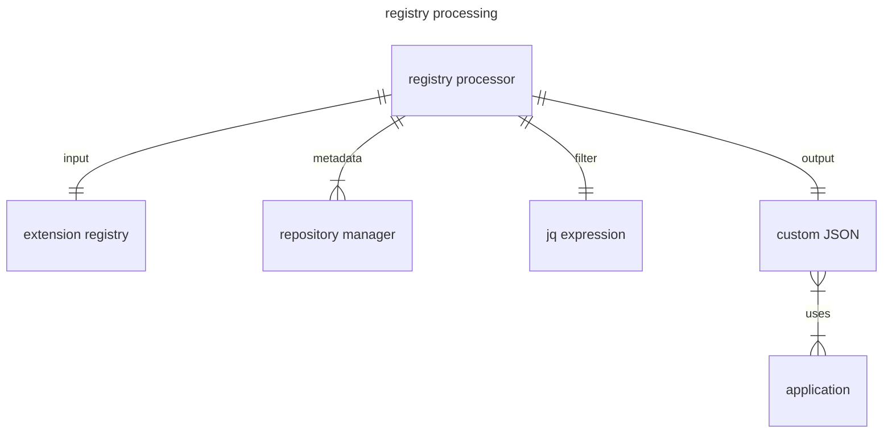

# k6 Extension Registry Concept

## Registry Source

The k6 extension registry source is a YAML file that contains the most important properties of extensions.

### File format

The k6 extension registry format is YAML, because the registry is edited by humans and the YAML format is more human-friendly than JSON. The files generated from the registry are typically in JSON format, because they are processed by programs and JSON is more widely supported than YAML. A JSON format is also generated from the entire registry, so that it can also be processed by programs.

### Registered Properties

Only those properties of the extensions are registered, which either cannot be detected automatically, or delegation to the extension is not allowed.

Properties that are available using the repository manager API (GitHub API, GitLab API, etc) are intentionally not registered. For example, the number of stars can be queried via the repository manager API, so this property is not registered.

Exceptions are the string-like properties that are embedded in the Grafana documentation. These properties are registered because it is not allowed to inject arbitrary text into the Grafana documentation site without approval. Therefore, these properties are registered (eg `description`)

The properties provided by the repository managers ([Repository Metadata]) are queried during registry processing and can be used to produce the output properties.

### Extension Identification

The primary identifier of an extension is the extension's [go module path].

The extension does not have a `name` property, the [repository metadata] can be used to construct a `name` property. Using the repository owner and the repository name, for example, `grafana/xk6-dashboard` can be generated for the `github.com/grafana/xk6-dashboard` extension.

The extension does not have a `url` property, but there is a `url` property in the [repository metadata].

[go module path]: https://go.dev/ref/mod#module-path
[Repository Metadata]: #repository-metadata

### JavaScript Modules

The JavaScript module names implemented by the extension can be specified in the `imports` property. An extension can register multiple JavaScript module names, so this is an array property.

### Output Names

The output names implemented by the extension can be specified in the `outputs` property. An extension can register multiple output names, so this is an array property.

### Cloud

The `true` value of the `cloud` flag indicates that the extension is also available in the Grafana k6 cloud. The use of certain extensions is not supported in a cloud environment. There may be a technological reason for this, or the extension's functionality is meaningless in the cloud.

### Official

The `true` value of the `official` flag indicates that the extension is officially supported by Grafana. Extensions owned by the `grafana` GitHub organization are not officially supported by Grafana by default. There are several k6 extensions owned by the `grafana` GitHub organization, which were created for experimental or example purposes only. The `official` flag is needed so that officially supported extensions can be distinguished from them.

### Example registry

```yaml file=example.yaml
- module: github.com/grafana/xk6-dashboard
  description: Web-based metrics dashboard for k6
  outputs:
    - dashboard
  official: true

- module: github.com/grafana/xk6-sql
  description: Load test SQL Servers
  imports:
    - k6/x/sql
  cloud: true
  official: true

- module: github.com/grafana/xk6-distruptor
  description: Inject faults to test
  imports:
    - k6/x/distruptor
  official: true

- module: github.com/szkiba/xk6-faker
  description: Generate random fake data
  imports:
    - k6/x/faker
```

### Repository Metadata

Repository metadata provided by the extension's git repository manager. Repository metadata are not registered, they are queried at processing time using the repository manager API.

#### URL

The `url` property contains the URL of the repository. The `url` is provided by the repository manager and can be displayed in a browser.

#### Homepage

The `homepage` property contains the the project homepage URL. If no homepage is set, the value is the same as the `url` property.

#### Stars

The `stars` property contains the number of stars in the extension's repository. The extension's popularity is indicated by how many users have starred the extension's repository.

#### Topics

The `topics` property contains the repository topics. Topics make it easier to find the repository. It is recommended to set the `xk6` topic to the extensions repository.

#### Tags

The `tags` property contains the repository's git tags. States of the git repository marked with tags can be reproduced. Versions are also tags, they must meet certain format requirements.

#### Versions

The `versions` property contains the list of supported versions. Versions are tags whose format meets the requirements of semantic versioning. Version tags often start with the letter `v`, which is not part of the semantic version.

## Registry Processing

The source of the registry is a YAML file optimized for human use. For programs that use the registry, it is advisable to generate an output in JSON format optimized for the given application (for example, an extension catalog for the k6build service).



The registry is processed based on the popular `jq` expressions. Predefined `jq` filters should be included for common uses (for example, extension catalog generation).

The input of the processing is the extension registry supplemented with repository metadata (for example, available versions, number of stars, etc). The output of the processing is defined by the `jq` filter.

### Registry Validation

The registry is validated using [JSON schema](https://grafana.github.io/k6registry/registry.schema.json). Requirements that cannot be validated using the JSON schema are validated using custom logic.

Custom validation logic checks the following for each extension:

  - is the go module path valid?
  - is there at least one versioned release?

Validation is always done before processing. The noop filter ('.') can be used for validation only by ignoring the output.

It is strongly recommended to validate the extension registry after each modification, but at least before approving the change.
