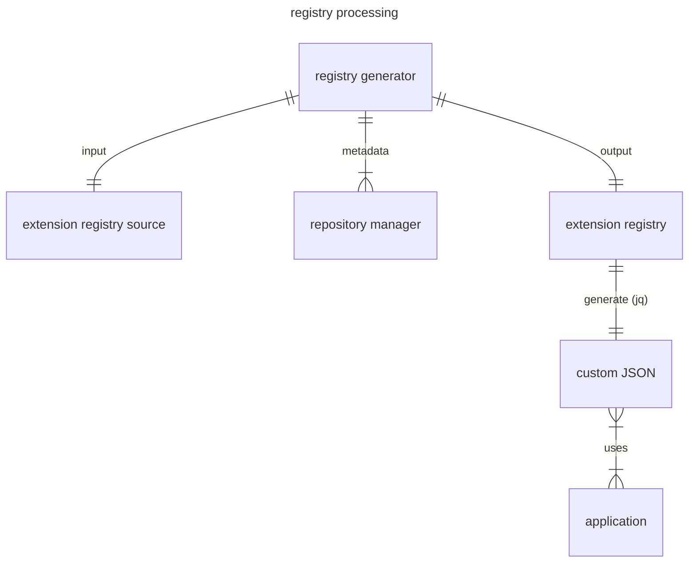

# k6 Extension Registry Concept

## Registry Source

The k6 extension registry source is a YAML file that contains the most important properties of extensions.

### File format

The k6 extension registry format is YAML, because the registry is edited by humans and the YAML format is more human-friendly than JSON. The files generated from the registry are typically in JSON format, because they are processed by programs and JSON is more widely supported than YAML. A JSON format is also generated from the entire registry, so that it can also be processed by programs.

### Registered Properties

Only those properties of the extensions are registered, which either cannot be detected automatically, or delegation to the extension is not allowed.

Properties that are available using the repository manager API (GitHub API, GitLab API, etc) are intentionally not registered. For example, the number of stars can be queried via the repository manager API, so this property is not registered.

Exceptions are the string-like properties that are embedded in the Grafana documentation. These properties are registered because it is not allowed to inject arbitrary text into the Grafana documentation site without approval. Therefore, these properties are registered (eg `description`)

The properties provided by the repository managers ([Repository Metadata]) are queried during registry processing and can be used to produce the output properties.

### Extension Identification

The primary identifier of an extension is the extension's [go module path].

The extension does not have a `name` property, the [repository metadata] can be used to construct a `name` property. Using the repository owner and the repository name, for example, `grafana/xk6-dashboard` can be generated for the `github.com/grafana/xk6-dashboard` extension.

The extension does not have a `url` property, but there is a `url` property in the [repository metadata].

[go module path]: https://go.dev/ref/mod#module-path
[Repository Metadata]: #repository-metadata

### JavaScript Modules

The JavaScript module names implemented by the extension can be specified in the `imports` property. An extension can register multiple JavaScript module names, so this is an array property.

### Output Names

The output names implemented by the extension can be specified in the `outputs` property. An extension can register multiple output names, so this is an array property.

#### Versions

The `versions` property contains the list of supported versions. Versions are tags whose format meets the requirements of semantic versioning. Version tags often start with the letter `v`, which is not part of the semantic version.

The `versions` property is usually queried through the API of the extension's repository manager. This can be overridden if the `versions` property is set in the source of the registry.

### Tier

Extensions can be classified according to who maintains the extension. This usually also specifies who the user can get support from.

The `tier` property refers to the maintainer of the extension.

Possible values:

  - **official**: Extensions owned, maintained, and designated by Grafana as "official"
  - **community**: Extensions are listed on the Registry by individual maintainers, groups of maintainers, or other members of the k6 community.

Extensions owned by the `grafana` GitHub organization are not officially supported by Grafana by default. There are several k6 extensions owned by the `grafana` GitHub organization, which were created for experimental or example purposes only. The `official` tier value is needed so that officially supported extensions can be distinguished from them.

If it is missing from the registry source, it will be set with the default `community` value during generation.

### Example registry

```yaml file=example.yaml
- module: github.com/grafana/xk6-dashboard
  description: Web-based metrics dashboard for k6
  outputs:
    - dashboard
  tier: official

- module: github.com/grafana/xk6-sql
  description: Load test SQL Servers
  imports:
    - k6/x/sql
  tier: official

- module: github.com/grafana/xk6-disruptor
  description: Inject faults to test
  imports:
    - k6/x/disruptor
  tier: official

- module: github.com/grafana/xk6-faker
  description: Generate random fake data
  imports:
    - k6/x/faker
  tier: official

- module: gitlab.com/szkiba/xk6-banner
  description: Print ASCII art banner from k6 test
  imports:
    - k6/x/banner
```

### Compliance Checks

Compliance checks are run after every repository modification and their results are stored in the `compliance` property. The registry contains up-to-date information on how well the extensions meet the requirements.

### Repository Metadata

Repository metadata provided by the extension's git repository manager. Repository metadata are not registered, they are queried at processing time using the repository manager API.

#### Owner

The `owner` property contains the owner of the extension's git repository.

#### Name

The `name` property contains the name of the extension's git repository.

#### License

The `license` property contains the SPDX ID of the extension's license. For more information about SPDX, visit https://spdx.org/licenses/

#### Public

The `true` value of the `public` flag indicates that the repository is public, available to anyone.

#### URL

The `url` property contains the URL of the repository. The `url` is provided by the repository manager and can be displayed in a browser.

#### Homepage

The `homepage` property contains the project homepage URL. If no homepage is set, the value is the same as the `url` property.

#### Stars

The `stars` property contains the number of stars in the extension's repository. The extension's popularity is indicated by how many users have starred the extension's repository.

#### Topics

The `topics` property contains the repository topics. Topics make it easier to find the repository. It is recommended to set the `xk6` topic to the extensions repository.

#### Archived

The `true` value of the `archived` flag indicates that the repository is archived, read only.

If a repository is archived, it usually means that the owner has no intention of maintaining it. Such extensions should be removed from the registry.

#### Timestamp

The `timestamp` property contains the timestamp of the last modification of the repository in UNIX time format (the number of non-leap seconds that have elapsed since 00:00:00 UTC on 1st January 1970).

Its value depends on the repository manager, in the case of GitHub it contains the time of the last push operation, in the case of GitLab the time of the last repository activity.

#### Clone URL

The `clone_url` property contains a (typically HTTP) URL, which is used to clone the repository.

## Registry Processing

The source of the registry is a YAML file optimized for human use. Since collecting extension metadata is a complicated and time-consuming task, it is advisable to extract this step into a registry generator CLI tool. The output of this tool is an extension registry in JSON format.

Generating custom JSON from the extension registry can be done with any standard JSON filtering tool, for example using the popular `jq` tool.



### Registry Validation

The registry is validated using [JSON schema](https://grafana.github.io/k6registry/registry.schema.json). Requirements that cannot be validated using the JSON schema are validated using custom linter.

Custom linter checks the following for each extension using [xk6 lint](https://github.com/grafana/xk6?tab=readme-ov-file#xk6-lint) command:

  - Is the go module path valid?
  - Is there at least one versioned release?
  - Is a valid license configured?
  - Is the xk6 topic set for the repository?
  - Is the repository not archived?

It is strongly recommended to lint the extension registry after each modification, but at least before approving the change.
